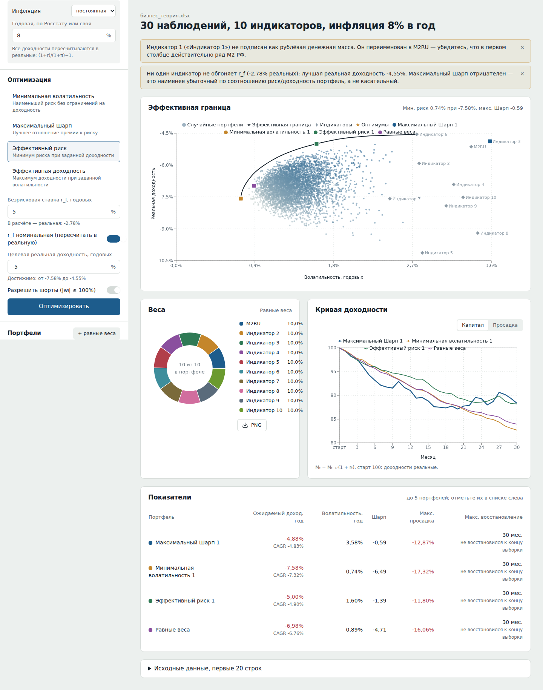
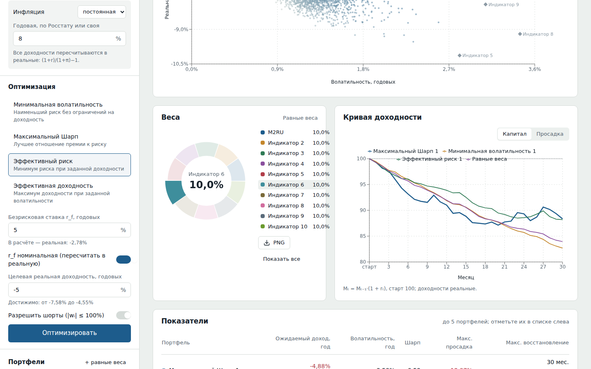
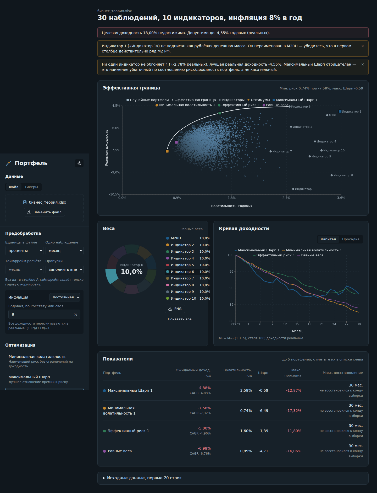

# Портфель

Веб-приложение для портфельного анализа по Марковицу: 4 режима оптимизации, эффективная граница с облаком Monte-Carlo, кривая доходности, интерактивная диаграмма весов и сравнение до 5 портфелей. Все доходности пересчитываются в реальные (за вычетом инфляции), Индикатор 1 — рублёвая денежная масса M2RU.



## Запуск

### Docker (одной командой)

```bash
docker-compose up --build
```

Приложение откроется на http://localhost:8080. Nginx отдаёт фронтенд и проксирует `/api` на бэкенд.

### Локально, без Docker

```bash
# бэкенд
cd backend
python -m venv .venv && source .venv/bin/activate   # Windows: .venv\Scripts\activate
pip install -r requirements-dev.txt
uvicorn main:app --reload --port 8000

# фронтенд, в другом терминале
cd frontend
npm install
npm run dev          # http://localhost:5173, /api проксируется на :8000
```

Swagger с описанием API: http://localhost:8000/docs.

### Render.com

1. Залейте репозиторий на GitHub.
2. В Render: **New → Blueprint**, выберите репозиторий. `render.yaml` создаст два сервиса:
   `portfolio-api` (Web Service, FastAPI) и `portfolio-web` (Static Site).
3. Адрес бэкенда попадает во фронтенд через `VITE_API_URL` автоматически (`fromService … property: host`).
4. После первого деплоя ссылки будут вида `https://portfolio-api-xxxx.onrender.com` и `https://portfolio-web-xxxx.onrender.com`.
   На бесплатном тарифе бэкенд засыпает после 15 минут простоя, первый запрос после этого идёт ~30–60 с.

Чтобы ограничить CORS, задайте в `portfolio-api` переменную `CORS_ORIGINS=https://portfolio-web-xxxx.onrender.com`.

### Тесты

```bash
cd backend && pytest -q
```

18 тестов: `sum(w)=1` и `w≥0` во всех 4 режимах, min-vol даёт σ не больше, чем max-Sharpe, max-Sharpe не хуже лучшего случайного портфеля, попадание в целевые доходность/волатильность, недостижимые цели дают понятную ошибку, монотонность границы, просадка и период восстановления на ручном примере, парсинг `бизнес теория.xlsx` (ровно 30 строк, 3–32), валидация «меньше 30 наблюдений», экспорт в Excel.

## Резервный мини-ассистент

При ошибках загрузки, загрузки тикеров, оптимизации, построения границы, сравнения или экспорта интерфейс автоматически отправляет в OpenRouter этап, сообщение об ошибке и контекст операции. Для расчётных ошибок передаются набор доходностей, настройки и веса портфелей; при сбое загрузки файла передаются его имя, размер и тип. Большие ряды сокращаются до первых 60 и последних 40 наблюдений, если контекст превышает лимит. Ключ остаётся на бэкенде. Модель анализирует сбой и выводит объяснение с шагами проверки; сами расчёты и изменение данных остаются за приложением.

Локально ключ читается из корневого .env (он исключён из Git). Docker Compose передаёт ключ только бэкенду. Для Render добавьте OPENROUTER_API_KEY как secret environment variable в сервис portfolio-api. Модель можно переопределить переменной OPENROUTER_MODEL.

## Как пользоваться

1. **Данные.** Перетащите Excel/CSV в панель слева. Формат как в `бизнес теория.xlsx`: строка заголовков с 10 индикаторами (столбцы B–K), ниже наблюдения; столбец A — дата или номер периода. Строки с формулами (например, `AVERAGE` в строке 33) отбрасываются. Второй вариант — вкладка «Тикеры»: 9 тикеров Yahoo Finance или Мосбиржи (`MOEX:IMOEX`, `MOEX:SBER`) плюс CSV с рядом M2 («дата;значение»).
2. **Предобработка.** Единицы (проценты/доли — определяются автоматически), длина одного наблюдения, таймфрейм расчёта (агрегация доступна при датах в столбце A), обработка пропусков, инфляция — постоянная годовая или свой ряд по периодам.
3. **Оптимизация.** Выберите режим, введите параметры, нажмите «Оптимизировать». Портфель сохраняется в IndexedDB браузера и автоматически добавляется в сравнение (до 5).
4. **Анализ.** Точки ваших портфелей отмечены на границе квадратами. Клик по сектору или строке легенды в диаграмме весов изолирует актив; кнопка PNG сохраняет диаграмму. Кривая доходности переключается на график просадок.
5. **Экспорт.** Excel (веса, показатели, кривые, реальные доходности) или CSV с весами.



## Методика

| Величина | Формула |
|---|---|
| Реальная доходность | `(1 + r) / (1 + π) − 1`, π за период из годовой: `(1 + π_год)^(1/k) − 1` |
| Ожидаемый доход | `mean(r_p) · k` (среднегодовой, арифметический); дополнительно CAGR |
| Волатильность | `std(r_p) · √k` |
| Шарп | `(E[r_p] − r_f) / σ_p` |
| Кривая капитала | `M_t = M_{t−1} · (1 + r_t)`, `M_0 = 100` |
| Макс. просадка | `min_t (M_t / max_{s≤t} M_s − 1)` |
| Макс. период восстановления | самый длинный отрезок от пика до первого возврата к его уровню, в периодах; если к концу выборки не восстановился — считается до конца и помечается |

`k` — число периодов в году: 252, 52, 12, 4, 1.

Решения, которые стоит знать:

- **r_f тоже пересчитывается в реальную** (переключатель «r_f номинальная», включён по умолчанию). Иначе Шарп сравнивал бы реальные доходности с номинальной ставкой.
- **Если ни один актив не обгоняет r_f**, максимальный Шарп отрицателен. Оптимизатор всё равно возвращает портфель (наименее плохое соотношение), но показывает предупреждение: это не касательный портфель, и лежит он не на эффективной границе.
- **«Эффективная доходность»** (`max wᵀμ` при `σ = target`) решается с ограничением `σ ≤ target`. Равенство невыпукло, а на эффективной ветви оба варианта дают одно решение.
- **Шорты**: при включённом тумблере `−100% ≤ wᵢ ≤ 100%`, сумма весов по-прежнему 1.
- **Валидация**: ровно 10 индикаторов, ≥ 30 наблюдений после обработки, нет NaN/inf, нет рядов с нулевой дисперсией.
- **Логирование**: каждая оптимизация пишет в stdout режим, параметры, итоговые веса, доходность и риск (`LOG_LEVEL`).

## API

| Метод | Endpoint | Описание |
|---|---|---|
| POST | `/api/upload` | multipart-файл → датасет, превью 20 строк, предупреждения |
| POST | `/api/load-tickers` | `{tickers, start, end, frequency, m2_levels}` → датасет |
| POST | `/api/optimize` | `{mode, returns, settings, risk_free, target_return, target_vol, allow_short}` → веса и метрики |
| POST | `/api/efficient-frontier` | те же данные → граница, облако Monte-Carlo, min-vol, max-Sharpe, точки активов |
| POST | `/api/portfolio/metrics` | веса + данные → метрики кривой |
| POST | `/api/compare` | список портфелей (до 5) → кривые, просадки, метрики |
| POST | `/api/export` | список портфелей → `.xlsx` |
| GET | `/api/health` | проверка живости |

`returns` — номинальные доходности в исходных единицах, `settings` — единицы, частота, инфляция. Предобработка выполняется на бэкенде в каждом запросе, поэтому смена инфляции или таймфрейма сразу пересчитывает всё.

## Структура

```
portfolio-app/
├── backend/
│   ├── main.py            # FastAPI
│   ├── optimizer.py       # 4 режима, граница, Monte-Carlo
│   ├── metrics.py         # доход, σ, Шарп, просадка, восстановление
│   ├── data_loader.py     # Excel/CSV, yfinance, MOEX ISS, инфляция, валидация
│   ├── tests/             # pytest + пример бизнес_теория.xlsx
│   └── requirements.txt
├── frontend/
│   └── src/
│       ├── components/    # FrontierChart, WeightsPie, CompareView, ControlPanel, DataSource, PortfolioList, ui/
│       ├── pages/         # Dashboard
│       └── api/           # клиент API
├── docker-compose.yml
├── render.yaml
└── README.md
```

UI-компоненты в `components/ui` написаны в стиле shadcn/ui (cva + tailwind-merge), `components.json` лежит в корне фронтенда, так что `npx shadcn add …` добавит новые компоненты в ту же структуру.

## Тёмная тема


